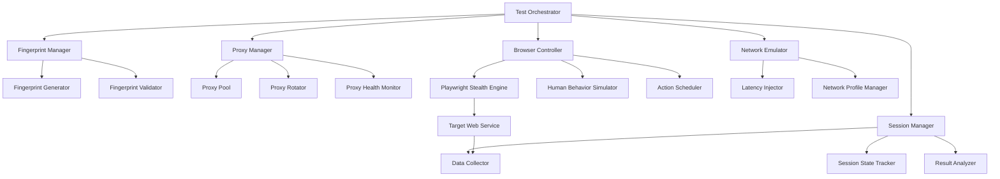
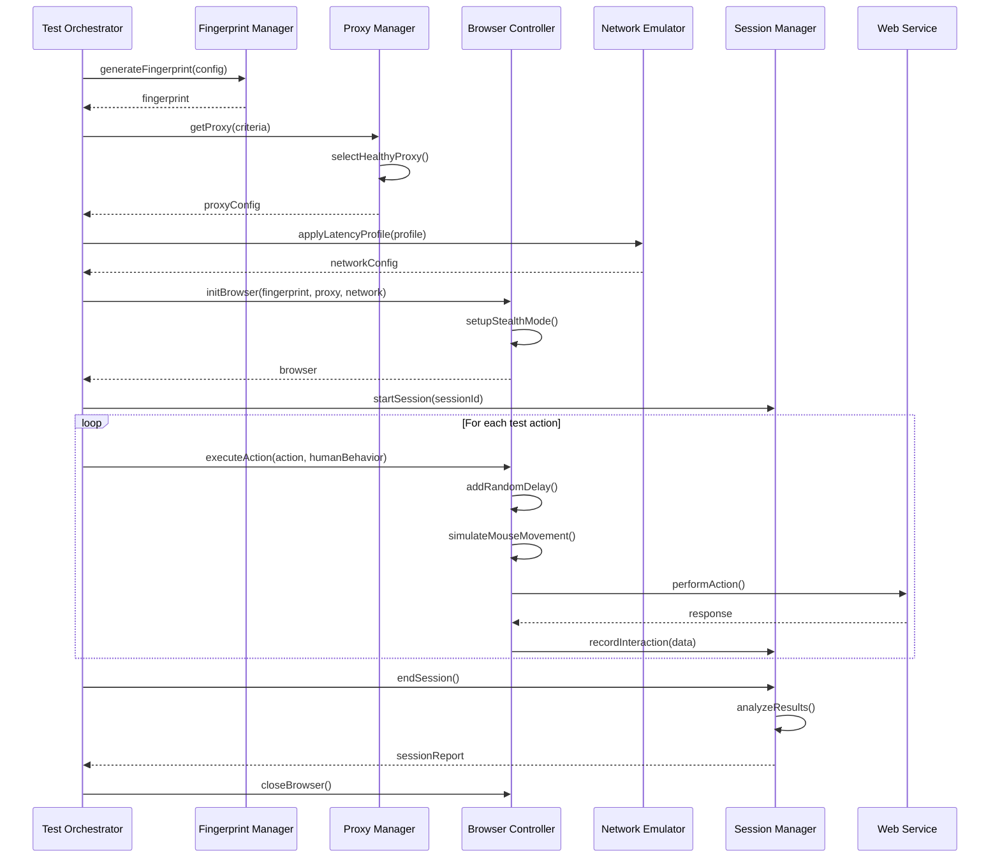
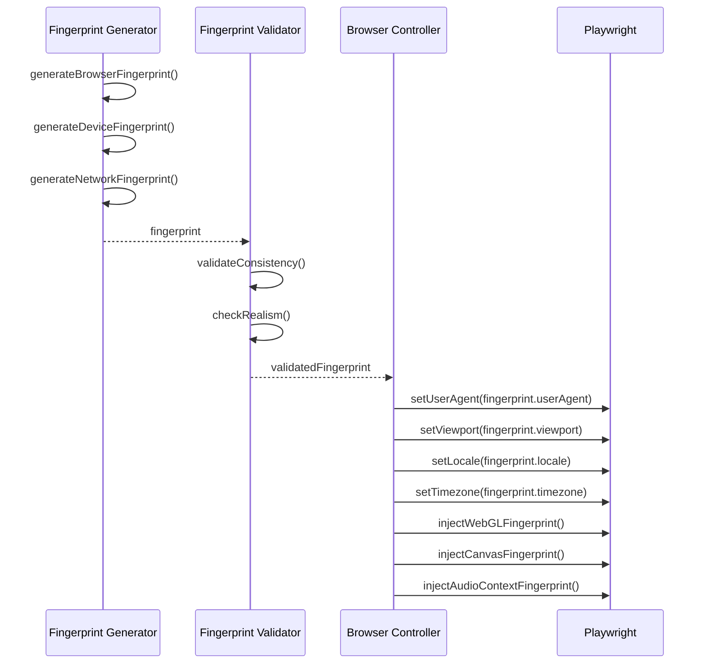

# Design Document: Browser Fingerprint Testing Framework

## Overview

The Browser Fingerprint Testing Framework is a comprehensive cybersecurity research tool designed to evaluate web service behavior under various residential proxy configurations and browser fingerprinting scenarios. The framework leverages Python and Playwright with stealth plugins to create realistic automated browsing sessions that mimic genuine human interaction patterns. This system enables security researchers to systematically test how different web services detect, fingerprint, and respond to automated sessions, providing valuable insights into anti-bot detection mechanisms and proxy configuration effectiveness.

The framework is architected as a modular, extensible system with clear separation of concerns: fingerprint generation and manipulation, proxy management, browser automation with human-like behavior simulation, network latency emulation, and comprehensive data collection and analysis. Each component is designed to be independently testable and configurable, allowing researchers to customize test scenarios for specific research objectives.

The primary goal is to provide a professional-grade research platform that can generate reproducible, scientifically rigorous results while maintaining ethical research standards and respecting target service terms of service.

## Architecture



## Sequence Diagrams

### Main Test Execution Flow



### Fingerprint Generation and Application



## Components and Interfaces

### Component 1: Test Orchestrator

**Purpose**: Central coordinator that manages test execution lifecycle, orchestrates all subsystems, and ensures proper sequencing of operations.

**Interface**:
```python
from typing import List, Dict, Any, Optional
from dataclasses import dataclass
from enum import Enum

class TestOrchestrator:
    """Main controller for test execution."""
    
    def __init__(
        self,
        fingerprint_manager: FingerprintManager,
        proxy_manager: ProxyManager,
        browser_controller: BrowserController,
        network_emulator: NetworkEmulator,
        session_manager: SessionManager
    ):
        """Initialize orchestrator with all required components."""
        pass
    
    async def execute_test_suite(
        self,
        test_config: TestConfiguration
    ) -> TestSuiteResult:
        """Execute a complete test suite with multiple scenarios."""
        pass
    
    async def execute_single_test(
        self,
        test_scenario: TestScenario
    ) -> TestResult:
        """Execute a single test scenario."""
        pass
    
    async def cleanup(self) -> None:
        """Clean up all resources and close connections."""
        pass
```

**Responsibilities**:
- Initialize and coordinate all subsystem components
- Execute test scenarios in proper sequence
- Handle errors and ensure graceful degradation
- Manage resource cleanup and session lifecycle
- Aggregate results from multiple test runs

### Component 2: Fingerprint Manager

**Purpose**: Generate and manage browser fingerprints that mimic real devices and browsers, ensuring consistency and realism across all fingerprint attributes.

**Interface**:
```python
from typing import Dict, Any, Optional
from dataclasses import dataclass

@dataclass
class BrowserFingerprint:
    """Complete browser fingerprint data."""
    user_agent: str
    platform: str
    vendor: str
    renderer: str
    languages: List[str]
    screen: Dict[str, int]
    viewport: Dict[str, int]
    timezone: str
    webgl_vendor: str
    webgl_renderer: str
    canvas_hash: str
    audio_hash: str
    fonts: List[str]
    plugins: List[Dict[str, str]]
    hardware_concurrency: int
    device_memory: int
    max_touch_points: int

class FingerprintManager:
    """Manages fingerprint generation and validation."""
    
    def __init__(self, fingerprint_db_path: Optional[str] = None):
        """Initialize with optional fingerprint database."""
        pass
    
    def generate_fingerprint(
        self,
        profile: str = "residential_windows",
        consistency_level: str = "high"
    ) -> BrowserFingerprint:
        """Generate a realistic browser fingerprint."""
        pass
    
    def validate_fingerprint(
        self,
        fingerprint: BrowserFingerprint
    ) -> bool:
        """Validate fingerprint for consistency and realism."""
        pass
    
    def load_fingerprint_from_file(
        self,
        filepath: str
    ) -> BrowserFingerprint:
        """Load a pre-generated fingerprint from file."""
        pass
    
    def save_fingerprint_to_file(
        self,
        fingerprint: BrowserFingerprint,
        filepath: str
    ) -> None:
        """Save fingerprint to file for reuse."""
        pass
```

**Responsibilities**:
- Generate realistic browser fingerprints matching real device profiles
- Ensure all fingerprint attributes are internally consistent
- Validate fingerprint realism against known patterns
- Support multiple device profiles (Windows, macOS, Linux, mobile)
- Provide fingerprint persistence for reproducible tests

### Component 3: Proxy Manager

**Purpose**: Manage residential proxy pool, handle proxy rotation, monitor proxy health, and ensure optimal proxy selection for test scenarios.

**Interface**:
```python
from typing import List, Dict, Any, Optional
from dataclasses import dataclass
from enum import Enum

class ProxyType(Enum):
    RESIDENTIAL = "residential"
    DATACENTER = "datacenter"
    MOBILE = "mobile"

@dataclass
class ProxyConfig:
    """Proxy configuration data."""
    host: str
    port: int
    username: Optional[str]
    password: Optional[str]
    proxy_type: ProxyType
    country: str
    city: Optional[str]
    isp: Optional[str]

@dataclass
class ProxyHealth:
    """Proxy health metrics."""
    is_alive: bool
    response_time_ms: float
    success_rate: float
    last_checked: float
    consecutive_failures: int

class ProxyManager:
    """Manages proxy pool and rotation."""
    
    def __init__(self, proxy_list_path: str):
        """Initialize with proxy list configuration."""
        pass
    
    async def get_proxy(
        self,
        criteria: Dict[str, Any]
    ) -> ProxyConfig:
        """Get a healthy proxy matching criteria."""
        pass
    
    async def check_proxy_health(
        self,
        proxy: ProxyConfig
    ) -> ProxyHealth:
        """Check if proxy is healthy and responsive."""
        pass
    
    async def rotate_proxy(
        self,
        current_proxy: ProxyConfig
    ) -> ProxyConfig:
        """Rotate to a different proxy."""
        pass
    
    async def remove_dead_proxy(
        self,
        proxy: ProxyConfig
    ) -> None:
        """Remove a non-functional proxy from the pool."""
        pass
    
    def get_proxy_statistics(self) -> Dict[str, Any]:
        """Get statistics about proxy pool usage."""
        pass
```

**Responsibilities**:
- Maintain pool of residential proxies with metadata
- Monitor proxy health and response times
- Implement intelligent proxy selection based on criteria
- Handle proxy rotation strategies
- Track proxy usage statistics and success rates

### Component 4: Browser Controller

**Purpose**: Control Playwright browser instances with stealth configurations and simulate realistic human interaction patterns.

**Interface**:
```python
from typing import List, Dict, Any, Optional, Callable
from playwright.async_api import Browser, BrowserContext, Page
from dataclasses import dataclass

@dataclass
class HumanBehaviorConfig:
    """Configuration for human behavior simulation."""
    typing_speed_wpm: int
    mouse_speed_pixels_per_sec: int
    scroll_behavior: str
    think_time_range_sec: tuple[float, float]
    error_rate: float

class BrowserController:
    """Controls browser automation with stealth and human behavior."""
    
    def __init__(self):
        """Initialize browser controller."""
        pass
    
    async def initialize_browser(
        self,
        fingerprint: BrowserFingerprint,
        proxy: ProxyConfig,
        headless: bool = True
    ) -> Browser:
        """Initialize Playwright browser with stealth configuration."""
        pass
    
    async def create_context(
        self,
        browser: Browser,
        fingerprint: BrowserFingerprint
    ) -> BrowserContext:
        """Create browser context with fingerprint applied."""
        pass
    
    async def navigate_to_url(
        self,
        page: Page,
        url: str,
        wait_until: str = "networkidle"
    ) -> None:
        """Navigate to URL with human-like timing."""
        pass
    
    async def type_text(
        self,
        page: Page,
        selector: str,
        text: str,
        behavior: HumanBehaviorConfig
    ) -> None:
        """Type text with human-like speed and errors."""
        pass
    
    async def click_element(
        self,
        page: Page,
        selector: str,
        behavior: HumanBehaviorConfig
    ) -> None:
        """Click element with realistic mouse movement."""
        pass
    
    async def scroll_page(
        self,
        page: Page,
        direction: str,
        behavior: HumanBehaviorConfig
    ) -> None:
        """Scroll page with human-like patterns."""
        pass
    
    async def simulate_mouse_movement(
        self,
        page: Page,
        start: tuple[int, int],
        end: tuple[int, int],
        behavior: HumanBehaviorConfig
    ) -> None:
        """Simulate realistic mouse movement with curves."""
        pass
    
    async def inject_stealth_scripts(
        self,
        page: Page
    ) -> None:
        """Inject stealth scripts to avoid detection."""
        pass
    
    async def close_browser(
        self,
        browser: Browser
    ) -> None:
        """Close browser and cleanup resources."""
        pass
```

**Responsibilities**:
- Initialize Playwright browser with stealth configurations
- Apply browser fingerprints to contexts
- Simulate human-like interaction patterns (typing, clicking, scrolling)
- Inject anti-detection scripts
- Manage browser lifecycle and cleanup

### Component 5: Network Emulator

**Purpose**: Emulate network latency profiles to simulate realistic residential connection characteristics.

**Interface**:
```python
from typing import Dict, Any, Optional
from dataclasses import dataclass

@dataclass
class LatencyProfile:
    """Network latency profile configuration."""
    name: str
    min_latency_ms: int
    max_latency_ms: int
    jitter_ms: int
    packet_loss_rate: float
    download_speed_mbps: float
    upload_speed_mbps: float

class NetworkEmulator:
    """Emulates network conditions for realistic testing."""
    
    def __init__(self):
        """Initialize network emulator."""
        pass
    
    def create_latency_profile(
        self,
        profile_name: str,
        config: Dict[str, Any]
    ) -> LatencyProfile:
        """Create a custom latency profile."""
        pass
    
    def get_preset_profile(
        self,
        profile_type: str
    ) -> LatencyProfile:
        """Get a preset latency profile (e.g., 'residential_cable', 'mobile_4g')."""
        pass
    
    async def apply_latency_profile(
        self,
        page: Page,
        profile: LatencyProfile
    ) -> None:
        """Apply latency profile to browser page."""
        pass
    
    async def inject_random_latency(
        self,
        min_ms: int,
        max_ms: int
    ) -> None:
        """Inject random latency delay."""
        pass
    
    def calculate_realistic_delay(
        self,
        profile: LatencyProfile
    ) -> float:
        """Calculate realistic delay based on profile."""
        pass
```

**Responsibilities**:
- Define network latency profiles for different connection types
- Apply latency to browser requests via CDP
- Simulate realistic network jitter and packet loss
- Provide preset profiles for common scenarios

### Component 6: Session Manager

**Purpose**: Track session state, collect interaction data, and analyze test results.

**Interface**:
```python
from typing import List, Dict, Any, Optional
from dataclasses import dataclass
from datetime import datetime

@dataclass
class SessionData:
    """Complete session data."""
    session_id: str
    start_time: datetime
    end_time: Optional[datetime]
    fingerprint: BrowserFingerprint
    proxy: ProxyConfig
    latency_profile: LatencyProfile
    interactions: List[Dict[str, Any]]
    detection_events: List[Dict[str, Any]]
    success: bool
    error_message: Optional[str]

class SessionManager:
    """Manages test session lifecycle and data collection."""
    
    def __init__(self, output_dir: str):
        """Initialize session manager with output directory."""
        pass
    
    def start_session(
        self,
        session_id: str,
        fingerprint: BrowserFingerprint,
        proxy: ProxyConfig,
        latency_profile: LatencyProfile
    ) -> SessionData:
        """Start a new test session."""
        pass
    
    def record_interaction(
        self,
        session_id: str,
        interaction_type: str,
        data: Dict[str, Any]
    ) -> None:
        """Record an interaction event."""
        pass
    
    def record_detection_event(
        self,
        session_id: str,
        event_type: str,
        details: Dict[str, Any]
    ) -> None:
        """Record a detection or blocking event."""
        pass
    
    def end_session(
        self,
        session_id: str,
        success: bool,
        error_message: Optional[str] = None
    ) -> SessionData:
        """End session and finalize data."""
        pass
    
    def save_session_data(
        self,
        session: SessionData,
        filepath: str
    ) -> None:
        """Save session data to file."""
        pass
    
    def analyze_sessions(
        self,
        session_ids: List[str]
    ) -> Dict[str, Any]:
        """Analyze multiple sessions and generate report."""
        pass
```

**Responsibilities**:
- Track session lifecycle and state
- Record all interactions and events
- Detect and log anti-bot detection events
- Generate session reports and analytics
- Persist session data for later analysis

## Data Models

### TestConfiguration

```python
from typing import List, Dict, Any, Optional
from dataclasses import dataclass

@dataclass
class TestConfiguration:
    """Complete test configuration."""
    test_suite_name: str
    target_urls: List[str]
    fingerprint_profiles: List[str]
    proxy_criteria: Dict[str, Any]
    latency_profiles: List[str]
    human_behavior_config: HumanBehaviorConfig
    test_scenarios: List[TestScenario]
    max_concurrent_sessions: int
    session_timeout_sec: int
    retry_on_failure: bool
    max_retries: int
    output_directory: str
```

**Validation Rules**:
- `test_suite_name` must be non-empty string
- `target_urls` must contain at least one valid URL
- `max_concurrent_sessions` must be positive integer
- `session_timeout_sec` must be positive integer
- `max_retries` must be non-negative integer
- All profile names must reference valid profiles

### TestScenario

```python
@dataclass
class TestScenario:
    """Individual test scenario configuration."""
    scenario_id: str
    scenario_name: str
    target_url: str
    fingerprint_profile: str
    proxy_criteria: Dict[str, Any]
    latency_profile: str
    actions: List[TestAction]
    expected_outcome: str
    validation_rules: List[Dict[str, Any]]
```

**Validation Rules**:
- `scenario_id` must be unique within test suite
- `target_url` must be valid URL
- `actions` must contain at least one action
- All profile references must be valid

### TestAction

```python
@dataclass
class TestAction:
    """Single test action."""
    action_type: str  # navigate, click, type, scroll, wait, screenshot
    selector: Optional[str]
    value: Optional[str]
    wait_after_ms: int
    human_behavior: bool
    retry_on_error: bool
    validation: Optional[Dict[str, Any]]
```

**Validation Rules**:
- `action_type` must be one of: navigate, click, type, scroll, wait, screenshot
- For type actions: `value` must be non-empty
- For click actions: `selector` must be valid CSS selector
- `wait_after_ms` must be non-negative

### TestResult

```python
@dataclass
class TestResult:
    """Result from a single test scenario."""
    scenario_id: str
    session_data: SessionData
    success: bool
    detection_score: float
    performance_metrics: Dict[str, float]
    validation_results: List[Dict[str, Any]]
    screenshots: List[str]
    error_log: List[str]
```

**Validation Rules**:
- `detection_score` must be between 0.0 and 1.0
- `success` is True only if all validations passed

## Algorithmic Pseudocode

### Main Test Execution Algorithm

```python
async def execute_test_suite(config: TestConfiguration) -> TestSuiteResult:
    """
    Execute a complete test suite with multiple scenarios.
    
    Preconditions:
        - config is valid TestConfiguration
        - All required components are initialized
        - Output directory exists and is writable
    
    Postconditions:
        - All test scenarios executed or failed with logged errors
        - Session data saved to disk
        - Resources cleaned up
        - Returns complete TestSuiteResult
    
    Loop Invariants:
        - completed_tests + remaining_tests = total_tests
        - All completed tests have saved session data
        - Resource cleanup called for each closed session
    """
    # Initialize result aggregator
    results = []
    total_tests = len(config.test_scenarios)
    completed_tests = 0
    
    try:
        # Initialize all components
        fingerprint_manager = FingerprintManager()
        proxy_manager = ProxyManager(config.proxy_list_path)
        browser_controller = BrowserController()
        network_emulator = NetworkEmulator()
        session_manager = SessionManager(config.output_directory)
        
        # Execute each test scenario
        for scenario in config.test_scenarios:
            # Loop invariant check
            assert completed_tests + len(results) <= total_tests
            
            try:
                # Generate fingerprint for this scenario
                fingerprint = fingerprint_manager.generate_fingerprint(
                    profile=scenario.fingerprint_profile
                )
                
                # Get healthy proxy matching criteria
                proxy = await proxy_manager.get_proxy(
                    criteria=scenario.proxy_criteria
                )
                
                # Get latency profile
                latency_profile = network_emulator.get_preset_profile(
                    scenario.latency_profile
                )
                
                # Initialize browser with configurations
                browser = await browser_controller.initialize_browser(
                    fingerprint=fingerprint,
                    proxy=proxy,
                    headless=config.headless
                )
                
                # Create context and page
                context = await browser_controller.create_context(
                    browser=browser,
                    fingerprint=fingerprint
                )
                page = await context.new_page()
                
                # Apply network latency
                await network_emulator.apply_latency_profile(
                    page=page,
                    profile=latency_profile
                )
                
                # Start session tracking
                session = session_manager.start_session(
                    session_id=scenario.scenario_id,
                    fingerprint=fingerprint,
                    proxy=proxy,
                    latency_profile=latency_profile
                )
                
                # Execute test actions
                for action in scenario.actions:
                    await execute_action(
                        page=page,
                        action=action,
                        browser_controller=browser_controller,
                        session_manager=session_manager,
                        scenario_id=scenario.scenario_id
                    )
                
                # Validate results
                validation_results = await validate_scenario_outcome(
                    page=page,
                    scenario=scenario,
                    session=session
                )
                
                # End session
                session_data = session_manager.end_session(
                    session_id=scenario.scenario_id,
                    success=all(v["passed"] for v in validation_results)
                )
                
                # Create test result
                result = TestResult(
                    scenario_id=scenario.scenario_id,
                    session_data=session_data,
                    success=session_data.success,
                    detection_score=calculate_detection_score(session_data),
                    performance_metrics=calculate_performance_metrics(session_data),
                    validation_results=validation_results,
                    screenshots=session_data.screenshots,
                    error_log=session_data.errors
                )
                
                results.append(result)
                completed_tests += 1
                
                # Cleanup browser
                await browser_controller.close_browser(browser)
                
            except Exception as e:
                # Handle scenario failure
                logger.error(f"Scenario {scenario.scenario_id} failed: {e}")
                
                if config.retry_on_failure and scenario.retry_count < config.max_retries:
                    scenario.retry_count += 1
                    continue
                else:
                    # Record failure
                    results.append(create_failure_result(scenario, str(e)))
                    completed_tests += 1
        
        # Generate aggregate report
        suite_result = TestSuiteResult(
            test_suite_name=config.test_suite_name,
            total_tests=total_tests,
            passed_tests=sum(1 for r in results if r.success),
            failed_tests=sum(1 for r in results if not r.success),
            test_results=results,
            aggregate_metrics=calculate_aggregate_metrics(results)
        )
        
        return suite_result
        
    finally:
        # Ensure cleanup
        await cleanup_all_resources()
```

### Fingerprint Generation Algorithm

```python
def generate_fingerprint(profile: str, consistency_level: str) -> BrowserFingerprint:
    """
    Generate a realistic browser fingerprint matching device profile.
    
    Preconditions:
        - profile is valid profile name
        - consistency_level in ["low", "medium", "high"]
    
    Postconditions:
        - Returns valid BrowserFingerprint
        - All attributes internally consistent
        - Fingerprint passes realism checks
    
    Loop Invariants:
        - All processed attributes are consistent with previously generated attributes
        - Fingerprint remains valid throughout generation
    """
    # Load base profile configuration
    profile_config = load_profile_config(profile)
    
    # Generate base attributes
    user_agent = generate_user_agent(profile_config)
    platform = extract_platform_from_ua(user_agent)
    
    # Generate screen dimensions consistent with platform
    screen = generate_screen_dimensions(platform, profile_config)
    viewport = generate_viewport(screen, profile_config)
    
    # Generate WebGL fingerprint consistent with platform
    webgl_vendor, webgl_renderer = generate_webgl_fingerprint(
        platform=platform,
        consistency_level=consistency_level
    )
    
    # Generate canvas fingerprint
    canvas_hash = generate_canvas_hash(
        user_agent=user_agent,
        platform=platform
    )
    
    # Generate audio context fingerprint
    audio_hash = generate_audio_hash(
        platform=platform
    )
    
    # Generate hardware capabilities consistent with profile
    hardware_concurrency = generate_cpu_cores(profile_config)
    device_memory = generate_device_memory(profile_config)
    max_touch_points = 0 if platform != "mobile" else 5
    
    # Generate language and timezone
    languages = generate_languages(profile_config)
    timezone = generate_timezone(profile_config)
    
    # Generate installed fonts list
    fonts = generate_fonts_list(platform)
    
    # Generate plugins (empty for modern browsers)
    plugins = []
    
    # Create fingerprint object
    fingerprint = BrowserFingerprint(
        user_agent=user_agent,
        platform=platform,
        vendor="Google Inc.",
        renderer=webgl_renderer,
        languages=languages,
        screen=screen,
        viewport=viewport,
        timezone=timezone,
        webgl_vendor=webgl_vendor,
        webgl_renderer=webgl_renderer,
        canvas_hash=canvas_hash,
        audio_hash=audio_hash,
        fonts=fonts,
        plugins=plugins,
        hardware_concurrency=hardware_concurrency,
        device_memory=device_memory,
        max_touch_points=max_touch_points
    )
    
    # Validate consistency
    assert validate_fingerprint_consistency(fingerprint)
    
    return fingerprint
```

### Human-Like Typing Algorithm

```python
async def type_text(
    page: Page,
    selector: str,
    text: str,
    behavior: HumanBehaviorConfig
) -> None:
    """
    Type text with human-like speed, rhythm, and occasional errors.
    
    Preconditions:
        - page is valid Playwright Page
        - selector exists on page
        - text is non-empty string
        - behavior is valid HumanBehaviorConfig
    
    Postconditions:
        - Text is typed into element
        - Typing speed varies naturally
        - Occasional typos made and corrected if error_rate > 0
    
    Loop Invariants:
        - All previously typed characters are in the input field
        - Character index always <= len(text)
    """
    # Calculate base delay from WPM
    base_delay_ms = calculate_delay_from_wpm(behavior.typing_speed_wpm)
    
    # Focus on the element
    await page.click(selector)
    await asyncio.sleep(random.uniform(0.1, 0.3))
    
    # Type each character
    for i, char in enumerate(text):
        # Loop invariant: i represents current position
        assert i <= len(text)
        
        # Decide if typo should occur
        if random.random() < behavior.error_rate:
            # Type wrong character
            wrong_char = generate_nearby_key(char)
            await page.keyboard.press(wrong_char)
            
            # Pause (human realizes mistake)
            await asyncio.sleep(random.uniform(0.2, 0.5))
            
            # Delete wrong character
            await page.keyboard.press("Backspace")
            await asyncio.sleep(random.uniform(0.1, 0.2))
        
        # Type correct character
        await page.keyboard.press(char)
        
        # Variable delay with natural rhythm
        if char == ' ':
            # Longer pause after space
            delay = base_delay_ms * random.uniform(1.5, 2.5)
        elif char in '.,!?':
            # Longer pause after punctuation
            delay = base_delay_ms * random.uniform(2.0, 3.0)
        else:
            # Normal typing delay with variance
            delay = base_delay_ms * random.uniform(0.7, 1.3)
        
        await asyncio.sleep(delay / 1000.0)
    
    # Final pause after typing
    await asyncio.sleep(random.uniform(0.2, 0.5))
```

### Realistic Mouse Movement Algorithm

```python
async def simulate_mouse_movement(
    page: Page,
    start: tuple[int, int],
    end: tuple[int, int],
    behavior: HumanBehaviorConfig
) -> None:
    """
    Simulate realistic curved mouse movement between two points.
    
    Preconditions:
        - page is valid Playwright Page
        - start and end are valid (x, y) coordinates
        - behavior is valid HumanBehaviorConfig
    
    Postconditions:
        - Mouse moved from start to end position
        - Movement follows natural Bezier curve
        - Speed varies throughout movement
    
    Loop Invariants:
        - Current position moves closer to end position
        - Movement remains within viewport bounds
        - Step count increases monotonically
    """
    # Generate control points for Bezier curve
    control_points = generate_bezier_control_points(start, end)
    
    # Calculate total distance
    distance = math.sqrt((end[0] - start[0])**2 + (end[1] - start[1])**2)
    
    # Calculate number of steps based on distance and speed
    num_steps = int(distance / behavior.mouse_speed_pixels_per_sec * 60)
    num_steps = max(10, min(num_steps, 100))  # Clamp between 10 and 100
    
    # Move mouse along Bezier curve
    for step in range(num_steps + 1):
        # Loop invariant: step is valid and increasing
        assert 0 <= step <= num_steps
        
        # Calculate position along curve (t from 0 to 1)
        t = step / num_steps
        
        # Calculate point on Bezier curve
        x, y = calculate_bezier_point(control_points, t)
        
        # Add small random jitter
        x += random.uniform(-2, 2)
        y += random.uniform(-2, 2)
        
        # Move mouse to position
        await page.mouse.move(x, y)
        
        # Variable delay for natural movement
        # Slower at start and end, faster in middle
        speed_factor = calculate_easing_factor(t)
        delay = (1 / 60) * (2 - speed_factor)  # 60 FPS base
        
        await asyncio.sleep(delay)
    
    # Ensure we end exactly at target
    await page.mouse.move(end[0], end[1])
```

### Proxy Health Check Algorithm

```python
async def check_proxy_health(proxy: ProxyConfig) -> ProxyHealth:
    """
    Check proxy health and response metrics.
    
    Preconditions:
        - proxy is valid ProxyConfig
        - proxy.host and proxy.port are accessible
    
    Postconditions:
        - Returns ProxyHealth with current status
        - Response time measured if proxy is alive
        - is_alive reflects actual connectivity
    
    Loop Invariants: N/A (no loops in this function)
    """
    start_time = time.time()
    
    try:
        # Create proxy URL
        proxy_url = format_proxy_url(proxy)
        
        # Attempt connection through proxy
        async with httpx.AsyncClient(proxies={
            "http://": proxy_url,
            "https://": proxy_url
        }, timeout=10.0) as client:
            # Test with reliable endpoint
            response = await client.get("https://www.google.com")
            
            # Calculate response time
            response_time_ms = (time.time() - start_time) * 1000
            
            # Check if response is valid
            if response.status_code == 200:
                return ProxyHealth(
                    is_alive=True,
                    response_time_ms=response_time_ms,
                    success_rate=1.0,  # Updated by proxy manager
                    last_checked=time.time(),
                    consecutive_failures=0
                )
            else:
                return ProxyHealth(
                    is_alive=False,
                    response_time_ms=response_time_ms,
                    success_rate=0.0,
                    last_checked=time.time(),
                    consecutive_failures=1
                )
    
    except Exception as e:
        # Proxy failed
        return ProxyHealth(
            is_alive=False,
            response_time_ms=-1.0,
            success_rate=0.0,
            last_checked=time.time(),
            consecutive_failures=1
        )
```

## Key Functions with Formal Specifications

### Function 1: initialize_browser()

```python
async def initialize_browser(
    fingerprint: BrowserFingerprint,
    proxy: ProxyConfig,
    headless: bool = True
) -> Browser:
    """Initialize Playwright browser with stealth configuration and fingerprint."""
    pass
```

**Preconditions:**
- `fingerprint` is valid BrowserFingerprint object
- `proxy` is valid ProxyConfig object
- Playwright is installed and accessible

**Postconditions:**
- Returns initialized Browser instance
- Browser configured with stealth plugins
- Proxy settings applied
- Fingerprint ready to be applied to contexts

**Loop Invariants:** N/A

### Function 2: apply_latency_profile()

```python
async def apply_latency_profile(
    page: Page,
    profile: LatencyProfile
) -> None:
    """Apply network latency profile to browser page via CDP."""
    pass
```

**Preconditions:**
- `page` is valid Playwright Page object
- `profile` is valid LatencyProfile object
- CDP (Chrome DevTools Protocol) is accessible

**Postconditions:**
- Network latency emulation enabled on page
- All network requests delayed according to profile
- Latency profile remains active until changed or page closed

**Loop Invariants:** N/A

### Function 3: validate_fingerprint_consistency()

```python
def validate_fingerprint_consistency(
    fingerprint: BrowserFingerprint
) -> bool:
    """Validate that all fingerprint attributes are internally consistent."""
    pass
```

**Preconditions:**
- `fingerprint` is BrowserFingerprint object (may be invalid)

**Postconditions:**
- Returns True if and only if all attributes are consistent
- Checks platform matches user agent
- Checks screen/viewport relationship
- Checks hardware capabilities match platform
- No mutations to fingerprint

**Loop Invariants:**
- For validation loops: All previously checked attributes remain valid

### Function 4: execute_action()

```python
async def execute_action(
    page: Page,
    action: TestAction,
    browser_controller: BrowserController,
    session_manager: SessionManager,
    scenario_id: str
) -> None:
    """Execute a single test action with human behavior simulation."""
    pass
```

**Preconditions:**
- `page` is valid Playwright Page object
- `action` is valid TestAction object
- `browser_controller` is initialized
- `session_manager` is initialized
- `scenario_id` exists in session manager

**Postconditions:**
- Action executed on page
- Interaction recorded in session manager
- Human-like delays applied
- Page state changed according to action type

**Loop Invariants:** N/A

### Function 5: calculate_detection_score()

```python
def calculate_detection_score(session_data: SessionData) -> float:
    """Calculate detection likelihood score from session data."""
    pass
```

**Preconditions:**
- `session_data` is valid SessionData object
- Session has ended (end_time is not None)

**Postconditions:**
- Returns float between 0.0 (not detected) and 1.0 (definitely detected)
- Score based on detection events, response patterns, challenges
- Higher score indicates higher likelihood of bot detection

**Loop Invariants:**
- For scoring loops: Score remains between 0.0 and 1.0

## Example Usage

### Example 1: Basic Single Test Execution

```python
import asyncio
from browser_fingerprint_framework import (
    TestOrchestrator,
    FingerprintManager,
    ProxyManager,
    BrowserController,
    NetworkEmulator,
    SessionManager,
    TestConfiguration,
    TestScenario,
    TestAction,
    HumanBehaviorConfig
)

async def run_basic_test():
    """Execute a basic fingerprint test."""
    
    # Initialize components
    fingerprint_manager = FingerprintManager()
    proxy_manager = ProxyManager("proxies.json")
    browser_controller = BrowserController()
    network_emulator = NetworkEmulator()
    session_manager = SessionManager("./output")
    
    # Create orchestrator
    orchestrator = TestOrchestrator(
        fingerprint_manager=fingerprint_manager,
        proxy_manager=proxy_manager,
        browser_controller=browser_controller,
        network_emulator=network_emulator,
        session_manager=session_manager
    )
    
    # Define test scenario
    scenario = TestScenario(
        scenario_id="test_001",
        scenario_name="Basic Login Test",
        target_url="https://example.com/login",
        fingerprint_profile="residential_windows",
        proxy_criteria={"country": "US", "proxy_type": "residential"},
        latency_profile="residential_cable",
        actions=[
            TestAction(
                action_type="navigate",
                selector=None,
                value="https://example.com/login",
                wait_after_ms=2000,
                human_behavior=True,
                retry_on_error=False,
                validation=None
            ),
            TestAction(
                action_type="type",
                selector="#username",
                value="test_user",
                wait_after_ms=500,
                human_behavior=True,
                retry_on_error=False,
                validation=None
            ),
            TestAction(
                action_type="type",
                selector="#password",
                value="test_password",
                wait_after_ms=500,
                human_behavior=True,
                retry_on_error=False,
                validation=None
            ),
            TestAction(
                action_type="click",
                selector="#login-button",
                value=None,
                wait_after_ms=3000,
                human_behavior=True,
                retry_on_error=False,
                validation={"expect": "url_contains", "value": "dashboard"}
            )
        ],
        expected_outcome="successful_login",
        validation_rules=[
            {"type": "url_contains", "value": "dashboard"},
            {"type": "element_exists", "selector": "#user-profile"}
        ]
    )
    
    # Execute test
    result = await orchestrator.execute_single_test(scenario)
    
    # Print results
    print(f"Test {scenario.scenario_id}: {'PASSED' if result.success else 'FAILED'}")
    print(f"Detection Score: {result.detection_score:.2f}")
    print(f"Performance Metrics: {result.performance_metrics}")
    
    # Cleanup
    await orchestrator.cleanup()

# Run the test
if __name__ == "__main__":
    asyncio.run(run_basic_test())
```

### Example 2: Test Suite with Multiple Profiles

```python
async def run_profile_comparison_suite():
    """Execute test suite comparing different fingerprint profiles."""
    
    # Initialize orchestrator
    orchestrator = create_orchestrator()
    
    # Define test configuration
    config = TestConfiguration(
        test_suite_name="Profile Comparison Suite",
        target_urls=["https://example.com/login"],
        fingerprint_profiles=[
            "residential_windows",
            "residential_macos",
            "mobile_android",
            "mobile_ios"
        ],
        proxy_criteria={"country": "US", "proxy_type": "residential"},
        latency_profiles=["residential_cable", "mobile_4g"],
        human_behavior_config=HumanBehaviorConfig(
            typing_speed_wpm=45,
            mouse_speed_pixels_per_sec=300,
            scroll_behavior="smooth",
            think_time_range_sec=(1.0, 3.0),
            error_rate=0.02
        ),
        test_scenarios=generate_scenarios_for_profiles(),
        max_concurrent_sessions=3,
        session_timeout_sec=300,
        retry_on_failure=True,
        max_retries=2,
        output_directory="./output/profile_comparison"
    )
    
    # Execute suite
    suite_result = await orchestrator.execute_test_suite(config)
    
    # Generate comparison report
    print(f"\nTest Suite: {suite_result.test_suite_name}")
    print(f"Total Tests: {suite_result.total_tests}")
    print(f"Passed: {suite_result.passed_tests}")
    print(f"Failed: {suite_result.failed_tests}")
    print(f"\nAggregate Metrics:")
    for metric, value in suite_result.aggregate_metrics.items():
        print(f"  {metric}: {value}")
    
    # Cleanup
    await orchestrator.cleanup()

if __name__ == "__main__":
    asyncio.run(run_profile_comparison_suite())
```

### Example 3: Custom Fingerprint Generation

```python
def create_custom_fingerprint():
    """Generate and customize a browser fingerprint."""
    
    manager = FingerprintManager()
    
    # Generate base fingerprint
    fingerprint = manager.generate_fingerprint(
        profile="residential_windows",
        consistency_level="high"
    )
    
    # Customize specific attributes
    fingerprint.languages = ["en-US", "en"]
    fingerprint.timezone = "America/New_York"
    fingerprint.hardware_concurrency = 8
    fingerprint.device_memory = 16
    
    # Validate customization
    if manager.validate_fingerprint(fingerprint):
        print("Custom fingerprint is valid!")
        
        # Save for reuse
        manager.save_fingerprint_to_file(
            fingerprint=fingerprint,
            filepath="./fingerprints/custom_fp_001.json"
        )
    else:
        print("Custom fingerprint failed validation")
    
    return fingerprint
```

### Example 4: Network Latency Testing

```python
async def test_latency_profiles():
    """Test different network latency profiles."""
    
    emulator = NetworkEmulator()
    
    # Test with different profiles
    profiles = [
        emulator.get_preset_profile("residential_cable"),
        emulator.get_preset_profile("residential_dsl"),
        emulator.get_preset_profile("mobile_4g"),
        emulator.get_preset_profile("mobile_3g")
    ]
    
    results = []
    
    for profile in profiles:
        print(f"\nTesting with {profile.name}")
        print(f"  Latency: {profile.min_latency_ms}-{profile.max_latency_ms}ms")
        print(f"  Jitter: {profile.jitter_ms}ms")
        print(f"  Speed: {profile.download_speed_mbps}Mbps down")
        
        # Run test with this profile
        result = await run_test_with_profile(profile)
        results.append(result)
    
    return results
```

## Correctness Properties

The Browser Fingerprint Testing Framework must satisfy these correctness properties expressed as universal quantification statements:

### Property 1: Fingerprint Consistency
```
∀ fingerprint ∈ BrowserFingerprint:
    validate_fingerprint_consistency(fingerprint) = true ⟹
        (platform_matches_user_agent(fingerprint) ∧
         screen_contains_viewport(fingerprint) ∧
         hardware_matches_platform(fingerprint))
```

### Property 2: Session Data Integrity
```
∀ session ∈ SessionData:
    session.end_time ≠ null ⟹
        (session.start_time < session.end_time ∧
         len(session.interactions) > 0 ∧
         session_data_persisted(session.session_id))
```

### Property 3: Proxy Health Invariant
```
∀ proxy ∈ ProxyPool:
    proxy.health.is_alive = true ⟹
        (proxy.health.response_time_ms > 0 ∧
         proxy.health.consecutive_failures = 0)
```

### Property 4: Human Behavior Timing
```
∀ action ∈ TestAction where action.human_behavior = true:
    execution_time(action) > minimum_human_time(action.action_type)
```

### Property 5: Test Result Completeness
```
∀ scenario ∈ TestScenario:
    execute_test(scenario) = result ⟹
        (result.session_data ≠ null ∧
         len(result.validation_results) = len(scenario.validation_rules) ∧
         result.success = all_validations_passed(result.validation_results))
```

### Property 6: Stealth Configuration Application
```
∀ browser ∈ Browser:
    initialize_browser(fingerprint, proxy, headless) = browser ⟹
        (stealth_scripts_injected(browser) ∧
         proxy_configured(browser, proxy) ∧
         fingerprint_applicable(browser, fingerprint))
```

### Property 7: Network Latency Bounds
```
∀ profile ∈ LatencyProfile, request ∈ NetworkRequest:
    apply_latency_profile(page, profile) ∧ page.makes_request(request) ⟹
        profile.min_latency_ms ≤ request.actual_latency_ms ≤ profile.max_latency_ms + profile.jitter_ms
```

### Property 8: Action Sequence Preservation
```
∀ scenario ∈ TestScenario:
    execute_test(scenario) ⟹
        ∀ i, j where 0 ≤ i < j < len(scenario.actions):
            timestamp(action[i]) < timestamp(action[j])
```

## Error Handling

### Error Scenario 1: Proxy Connection Failure

**Condition**: Proxy becomes unresponsive or returns connection errors during test execution

**Response**: 
- Log proxy failure with timestamp and error details
- Mark proxy as unhealthy in proxy pool
- Increment consecutive_failures counter
- If consecutive_failures > threshold (3), remove from active pool

**Recovery**:
- Automatically rotate to next healthy proxy matching criteria
- Retry current test action with new proxy
- If no healthy proxies available, pause test and alert user
- Resume when proxies become available

### Error Scenario 2: Bot Detection Challenge

**Condition**: Web service presents CAPTCHA or bot detection challenge

**Response**:
- Record detection event with challenge type and timestamp
- Capture screenshot of challenge page
- Log all fingerprint and proxy details used
- Increment detection_score for session

**Recovery**:
- End current session gracefully
- Mark test as failed due to detection
- Optionally retry with different fingerprint/proxy combination
- Aggregate detection data for analysis

### Error Scenario 3: Page Load Timeout

**Condition**: Page fails to load within configured timeout period

**Response**:
- Log timeout event with URL and duration
- Capture page state and network logs
- Record as interaction failure

**Recovery**:
- If retry_on_error is true and retries < max_retries, retry navigation
- If retry fails, skip remaining actions for this scenario
- Mark scenario as failed
- Continue to next scenario in test suite

### Error Scenario 4: Element Not Found

**Condition**: Expected element selector not found on page

**Response**:
- Log element selector and page URL
- Capture screenshot for debugging
- Record validation failure

**Recovery**:
- Wait additional time for dynamic content (up to 10 seconds)
- Retry selector lookup
- If still not found and retry_on_error is false, fail action
- If critical action, fail entire scenario

### Error Scenario 5: Invalid Fingerprint Configuration

**Condition**: Generated fingerprint fails consistency validation

**Response**:
- Log validation errors with specific inconsistencies
- Prevent fingerprint from being used
- Raise FingerprintValidationError

**Recovery**:
- Regenerate fingerprint with same profile
- If regeneration fails 3 times, alert user of profile configuration issue
- Suggest using different profile or manual fingerprint

### Error Scenario 6: Browser Crash

**Condition**: Playwright browser process crashes unexpectedly

**Response**:
- Log crash with stack trace and session data
- Save partial session data collected so far
- Mark session as crashed

**Recovery**:
- Clean up crashed browser resources
- Initialize new browser instance
- Retry scenario from beginning if retries available
- If crashes persist, suggest system resource check

## Testing Strategy

### Unit Testing Approach

**Objective**: Test individual components in isolation with mocked dependencies.

**Key Test Cases**:

1. **Fingerprint Generation Tests**
   - Test each profile generates valid fingerprints
   - Test fingerprint consistency validation catches inconsistencies
   - Test fingerprint serialization and deserialization
   - Test custom fingerprint attributes override correctly

2. **Proxy Manager Tests**
   - Test proxy health check correctly identifies dead proxies
   - Test proxy selection matches criteria
   - Test proxy rotation cycles through pool
   - Test proxy pool statistics calculations

3. **Browser Controller Tests**
   - Test stealth configuration applies correctly
   - Test fingerprint injection into browser context
   - Test human behavior timing calculations
   - Test mouse movement curve generation

4. **Network Emulator Tests**
   - Test latency profile creation and validation
   - Test preset profiles load correctly
   - Test latency calculations within bounds

5. **Session Manager Tests**
   - Test session lifecycle (start, record, end)
   - Test session data persistence
   - Test session analysis calculations

**Coverage Goals**: 
- Minimum 80% code coverage for all components
- 100% coverage for critical security and fingerprint logic
- All public API methods must have unit tests

### Property-Based Testing Approach

**Objective**: Use property-based testing to verify system behavior across wide input ranges.

**Property Test Library**: `hypothesis` (Python)

**Key Properties to Test**:

1. **Fingerprint Consistency Property**
   ```python
   @given(profile=st.sampled_from(["residential_windows", "residential_macos", "mobile_android"]))
   def test_fingerprint_consistency(profile):
       manager = FingerprintManager()
       fingerprint = manager.generate_fingerprint(profile)
       assert manager.validate_fingerprint(fingerprint) == True
   ```

2. **Timing Bounds Property**
   ```python
   @given(
       wpm=st.integers(min_value=20, max_value=120),
       text=st.text(min_size=1, max_size=100)
   )
   def test_typing_speed_bounds(wpm, text):
       config = HumanBehaviorConfig(typing_speed_wpm=wpm, ...)
       min_time = calculate_minimum_typing_time(text, wpm)
       max_time = calculate_maximum_typing_time(text, wpm)
       actual_time = simulate_typing_time(text, config)
       assert min_time <= actual_time <= max_time
   ```

3. **Latency Application Property**
   ```python
   @given(
       min_latency=st.integers(min_value=10, max_value=100),
       max_latency=st.integers(min_value=100, max_value=500),
       jitter=st.integers(min_value=0, max_value=50)
   )
   def test_latency_bounds(min_latency, max_latency, jitter):
       assume(min_latency < max_latency)
       profile = LatencyProfile(
           name="test",
           min_latency_ms=min_latency,
           max_latency_ms=max_latency,
           jitter_ms=jitter,
           ...
       )
       delay = calculate_realistic_delay(profile)
       assert min_latency <= delay <= max_latency + jitter
   ```

4. **Proxy Selection Property**
   ```python
   @given(
       criteria=st.dictionaries(
           keys=st.sampled_from(["country", "proxy_type", "min_speed"]),
           values=st.text()
       )
   )
   def test_proxy_matches_criteria(criteria):
       manager = ProxyManager("test_proxies.json")
       proxy = manager.get_proxy(criteria)
       assert proxy_matches_criteria(proxy, criteria)
   ```

**Coverage Goals**:
- Test all critical algorithms with property-based tests
- Generate 1000+ test cases per property
- Shrink failing cases to minimal reproducible examples

### Integration Testing Approach

**Objective**: Test component interactions and end-to-end workflows.

**Key Integration Tests**:

1. **Full Test Execution Flow**
   - Test complete scenario execution from initialization to cleanup
   - Verify all components communicate correctly
   - Verify session data flows through pipeline

2. **Browser Initialization with Fingerprint**
   - Test fingerprint actually applies to browser context
   - Verify JavaScript fingerprinting APIs return expected values
   - Test stealth plugins mask automation signals

3. **Proxy and Network Emulation Integration**
   - Test proxy configuration works with browser
   - Test network latency actually affects request timing
   - Verify proxy IP appears in requests

4. **Human Behavior Simulation**
   - Test typing, clicking, scrolling produce realistic timing
   - Verify mouse movements follow curves
   - Test error injection and correction

**Test Environment**:
- Use Docker containers for isolated test environments
- Mock external web services with test servers
- Use real proxy connections for proxy integration tests (optional)

## Performance Considerations

### Concurrency Management

The framework supports concurrent test execution to maximize throughput:

- **max_concurrent_sessions** controls parallel browser instances
- Each session runs in separate async task
- Browser instances are independent and isolated
- Recommended: 3-5 concurrent sessions per 16GB RAM
- Monitor system resources and adjust accordingly

### Memory Optimization

Browser automation is memory-intensive:

- Close browser contexts immediately after test completion
- Clean up page resources before navigation
- Limit screenshot capture to critical moments
- Implement periodic garbage collection for long test suites
- Use headless mode to reduce memory footprint

### Network Efficiency

Minimize network overhead:

- Reuse proxy connections when possible
- Cache proxy health check results (5-minute TTL)
- Batch session data writes to disk
- Compress session data before persistence

### Latency Budget

Total test scenario time budget:

- Browser initialization: 2-5 seconds
- Page navigation: 3-8 seconds (depends on latency profile)
- Human actions: Variable based on behavior config
- Recommended timeout: 300 seconds per scenario

## Security Considerations

### Ethical Research Standards

This framework is designed for legitimate security research:

- **Respect Terms of Service**: Always review and comply with target service ToS
- **Rate Limiting**: Implement delays between tests to avoid overwhelming services
- **Data Privacy**: Do not collect or store personal data from target services
- **Responsible Disclosure**: Report discovered vulnerabilities responsibly

### Proxy Authentication Security

Residential proxies require authentication:

- Store proxy credentials securely (environment variables or encrypted files)
- Never log proxy credentials in plain text
- Use secure credential management (e.g., Python keyring)
- Rotate proxy credentials regularly

### Fingerprint Data Protection

Fingerprint configurations may contain identifying information:

- Store fingerprints in secure directories with restricted permissions
- Avoid committing fingerprints to version control
- Use generic profiles for shared research
- Document fingerprint sources and generation methods

### Session Data Security

Test session data may contain sensitive information:

- Encrypt session data at rest
- Implement secure deletion for old session data
- Restrict access to output directories
- Sanitize session data before sharing

### Code Security

Follow secure coding practices:

- Validate all user inputs and configurations
- Use parameterized queries for database operations
- Implement proper exception handling
- Keep dependencies updated for security patches
- Use type hints and static analysis tools

## Dependencies

### Core Dependencies

**Python**: Version 3.10 or higher

**Playwright**: 
- `playwright>=1.40.0`
- Async browser automation framework
- Supports Chromium, Firefox, WebKit

**Playwright Stealth**:
- `playwright-stealth` or equivalent stealth plugin
- Masks automation indicators
- Prevents WebDriver detection

### Data Processing

**httpx**: 
- `httpx>=0.25.0`
- Async HTTP client for proxy health checks

**aiofiles**:
- `aiofiles>=23.0.0`
- Async file I/O operations

### Analysis and Utilities

**numpy**:
- `numpy>=1.24.0`
- Numerical computations for timing and curves

**scipy**:
- `scipy>=1.11.0`
- Bezier curve calculations for mouse movement

**Pillow**:
- `Pillow>=10.0.0`
- Screenshot processing and manipulation

### Testing Dependencies

**pytest**:
- `pytest>=7.4.0`
- Unit and integration testing framework

**pytest-asyncio**:
- `pytest-asyncio>=0.21.0`
- Async test support

**hypothesis**:
- `hypothesis>=6.88.0`
- Property-based testing library

**pytest-cov**:
- `pytest-cov>=4.1.0`
- Code coverage reporting

### Development Dependencies

**black**:
- `black>=23.0.0`
- Code formatting

**mypy**:
- `mypy>=1.5.0`
- Static type checking

**ruff**:
- `ruff>=0.1.0`
- Fast Python linter

### Optional Dependencies

**selenium-wire**:
- Optional for advanced network interception
- Alternative to CDP for network modification

**mitmproxy**:
- Optional for deep network inspection
- Useful for debugging proxy issues

### System Requirements

**Operating System**: Linux, macOS, or Windows

**RAM**: Minimum 8GB, recommended 16GB for concurrent testing

**Storage**: Minimum 2GB for framework and dependencies, additional space for session data

**Network**: Stable internet connection for proxy testing

### Installation

```bash
# Install core dependencies
pip install playwright httpx aiofiles numpy scipy Pillow

# Install Playwright browsers
playwright install chromium

# Install testing dependencies
pip install pytest pytest-asyncio hypothesis pytest-cov

# Install development dependencies
pip install black mypy ruff
```
